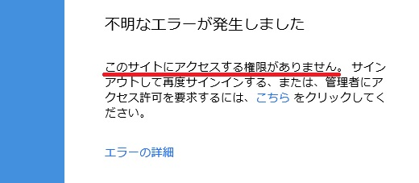
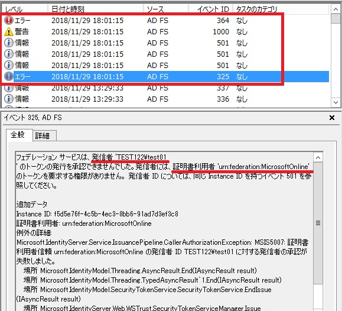
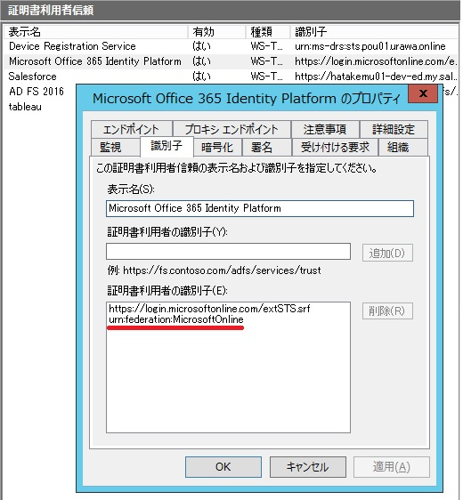
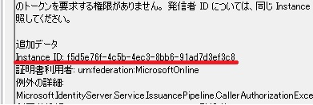
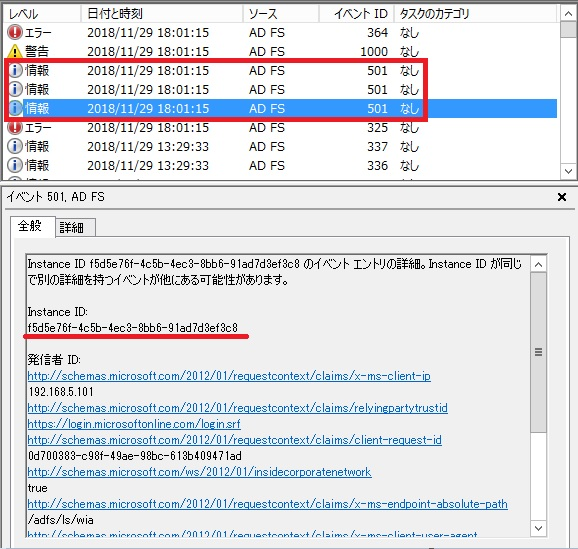
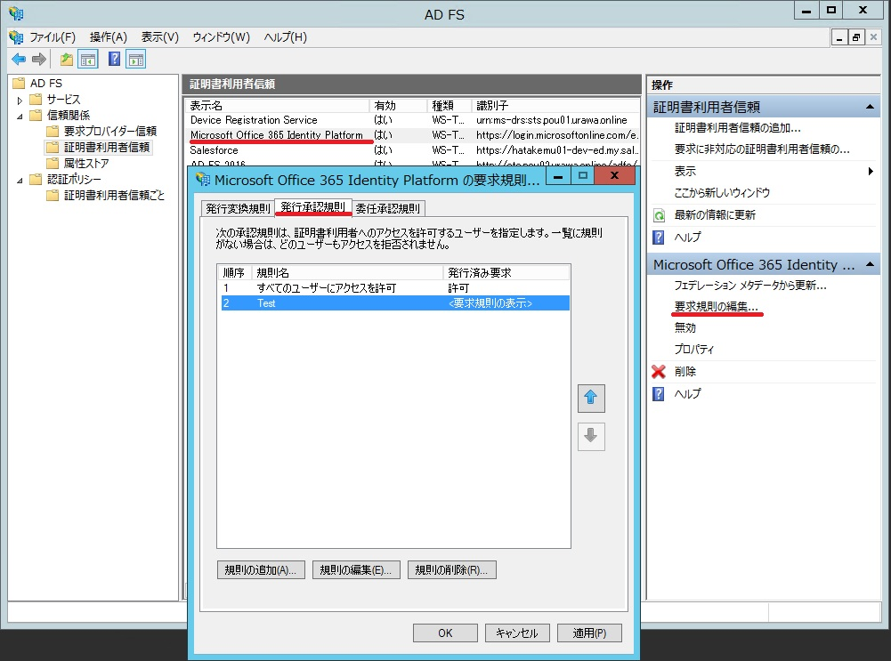
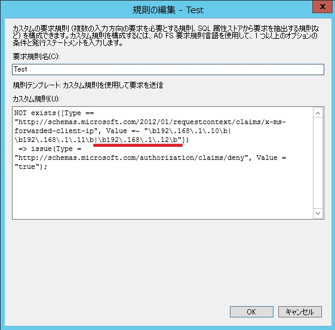

# AD FS クレームルール関連のトラブルシューティング

こんにちは、Azure & Identitiy サポートチームの竹村です。<br>
今回は、AD FS のクレームルールに関連した問題のトラブルシュート方法をご紹介します。

## エラー画面、エラーイベントの特徴

AD FS のクレームルールにより認証が失敗している場合、エラー画面やエラーイベントから容易に判断することができます。
ブラウザやモダン認証のアプリケーションからアクセスしている場合には、以下のように 「このサイトにアクセスする権限がありません。」と表示されます。




一部の Office クライアントなどで レガシー認証を使用している場合には、上記のようなブラウザの画面は表示されません。
しかし、クライアントの種類に関係なく、AD FS サーバー側のイベント ログ ( [アプリケーションとサービス ログ] - [AD FS] - [Admin] ) に、以下のようにイベント ID 325、501、1000、364 が記録されます。




上記の ID 325 の内容において、「発信者」(例では TEST122\test01) が認証したユーザーであり、「証明書利用者」(例では urn:federation:MicrosoftOnline) がアクセスを試みようとしたサービス (証明書利用者信頼) になります。
この証明書利用者信頼は、AD FS 管理ツールから確認することができます。
以下のように、信頼を結んでいるサービスのプロパティを開き、[識別子] のタブで確認することができます。(例は、Office 365 のものです。)




## トラブルシュートの方法

次に、意図せずクレームルールで認証がブロックされてしまう場合のトラブルシュート方法を紹介します。

### (1) 該当するイベント ログを探します
上述の通り、クレームルールによってブロックされている場合には、イベント ID 325、501、1000、364 が記録されます。
最初に、上記例のように、イベント ID 325 の内容を確認して認証したユーザー、サービスとタイムスタンプを突合し、該当するイベント ログを確認します。
レガシー認証などでエラー画面から判断できない場合、このイベントがエラー発生時間帯に記録されているかどうかで、クレームルールによる問題かどうかを判断することができます。
タイムスタンプ、ユーザー、サービスが一致するイベント ID 325 を見つけたら、次にイベント ID 501 を確認しますが、その際に Instance ID を参照します。



一連のイベントはおおよそ同じタイムスタンプに記録されますが、認証要求が多い場合などにはこの ID で判断します。<br>
Instance ID が同じ値となっているイベントは、同一の認証処理内で記録されたイベントになります。



イベント ID 501 には、発行されたクレームとその値が交互に出力されます。
例えば上記の例では、
"http://schemas.microsoft.com/2012/01/requestcontext/claims/x-ms-client-ip"  というクレームの値として、192.168.5.101 がセットされています。
同様に、"http://schemas.microsoft.com/2012/01/requestcontext/claims/relyingpartytrustid" というクレームの値として、"https://login.microsoftonline.com/login.srf" がセットされています。

```
クレーム
値

クレーム
値

...
```
という順番で記録されています。<br>
<br>
これらは、その量に応じて複数のイベント ID 501 にまたがって記録されます。<br>
どのイベントが該当の処理のものかを判断するために、先述の Instance ID を利用します。


### (2) クレーム ルールを確認し、イベント ID 501 に記録されているクレームの内容と比較します。

手順 (1) で、発行されているクレームを確認することができました。<br>
次に、AD FS に設定されているクレーム ルールを確認します。

クレーム ルールは、AD FS プライマリサーバー上で、以下のように Powershell を実行することで確認できます。

```
実行例:
※ Identifier オプションには、先述のイベント ID 325 で確認した対象の証明書利用者信頼の識別子を指定します。

(Get-AdfsRelyingPartyTrust -Identifier "urn:federation:MicrosoftOnline").IssuanceAuthorizationRules

@RuleTemplate = "AllowAllAuthzRule"
=> issue(Type = "http://schemas.microsoft.com/authorization/claims/permit", Value = "true");

@RuleName = "Test"
NOT exists([Type == "http://schemas.microsoft.com/2012/01/requestcontext/claims/x-ms-forwarded-client-ip", Value =~ "\b192\.168\.1\.10\b|\b192\.168\.1\.11\b"])
=> issue(Type = "http://schemas.microsoft.com/authorization/claims/deny", Value = "true");
```

クレームルールの詳細についてはここでは割愛しますが、基本的に以下のいずれかの構成になっています。

### (A) ホワイトリスト形式 (許可する条件を羅列する形式)
```
@ルール1
条件1 の場合には、アクセスを許可する

@ルール2
条件2 の場合には、アクセスを許可する

...
```

このような書き方の場合、羅列されたいずれかの許可のルール (条件) に合致しない場合、アクセスはブロックされます。


### (B) ブラックリスト形式 (拒否する条件を羅列する形式)
```
@ルール1
すべての条件でアクセスを許可

@ルール2
条件1 の場合には、アクセスをブロックする

@ルール3
条件2 の場合には、アクセスをブロックする

...
```

このような書き方の場合、羅列された拒否のルール (条件) のいずれかに合致した場合、アクセスはブロックされます。

「アクセスを許可する」に該当する記述は、

=> issue(Type = "http://schemas.microsoft.com/authorization/claims/<font color="Red">permit</font>", Value = "true");

です。

「アクセスを拒否する」に該当する記述は、

=> issue(Type = "http://schemas.microsoft.com/authorization/claims/<font color="Red">deny</font>", Value = "true");

です。

 
上述の実行例ですと、@RuleTemplate = "AllowAllAuthzRule" では、何の条件も指定せずにアクセスを許可しています。<br>
つまり、すべてのアクセスを許可しています。

@RuleName = "Test" では、

http://schemas.microsoft.com/2012/01/requestcontext/claims/x-ms-forwarded-client-ip

というクレームの値として、

"\b192\\.168\\.1\\.10\b|\b192\\.168\\.1\\.11\b"

という正規表現にマッチしない場合 (つまり、192.168.1.10 もしくは 192.168.1.11 ではない場合) には、アクセスを拒否しています。

```
※ 補足1
Value =~ と記述した場合、正規表現を使用することができます。
Value == と記述した場合には、完全一致になります。
```

```
※ 補足2
exists と記述した場合、そのようなクレームが存在する場合、という意味になります。
NOT exists と記述した場合、そのようなクレームが存在しない場合、という意味になります。
```

今回の例の場合、イベント ID 501 に記録されているクレームと値を確認すると、

"http://schemas.microsoft.com/2012/01/requestcontext/claims/x-ms-forwarded-client-ip"

というクレームに 192.168.1.10 もしくは 192.168.1.11 という値がセットされていないためにアクセスが拒否されていることが分かります。


### (3) クレーム ルールを修正します。

例えば、手順 (2) で確認したイベント ID 501 に、以下のような出力があったとします。

http://schemas.microsoft.com/2012/01/requestcontext/claims/x-ms-forwarded-client-ip<br>
192.168.1.12

このような場合には、192.168.1.10、192.168.1.11 に加えて、192.168.1.12 を許可するように追加します。<br>
(192.168.1.12 が、お客様の環境で許可すべき IP アドレスであることが確認できている前提です。)

クレーム ルールを編集するには、AD FS 管理ツールから該当の証明書利用者信頼を選択し、[要求規則の編集] ウィンドウを開いて [発行承認規則] から該当のルールを選択します。



※ もし、新しいルールを追加する場合には、この画面で [規則の追加] を行います。

今回の例では、Test というルールを選択して [規則の編集] を行います。



上記のように編集することで、
http://schemas.microsoft.com/2012/01/requestcontext/claims/x-ms-forwarded-client-ip に 192.168.1.12 がセットされている場合にもアクセスが拒否されないようになります。


よくあるケースとしては、ネットワークのアドレスが変わってしまったり、User Agent の文字列が意図していないものに変わってしまうことで、急に認証が拒否されてしまう場合があります。

 
いかがでしたでしょうか。<br>
<br>
AD FS のクレームルールによって認証に失敗している場合、上記のステップを踏むことで、ある程度機械的に検知、確認、対応が可能です。
<br>
上記内容が少しでも参考となりますと幸いです。
<br>
<br>
製品動作に関する正式な見解や回答については、お客様環境などを十分に把握したうえでサポート部門より提供させていただきますので、ぜひ弊社サポート サービスをご利用ください。<br>
<br>
※本情報の内容（添付文書、リンク先などを含む）は、作成日時点でのものであり、予告なく変更される場合があります。
